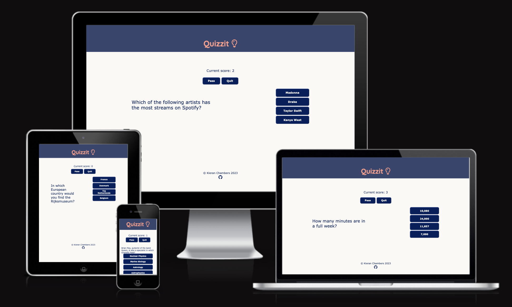
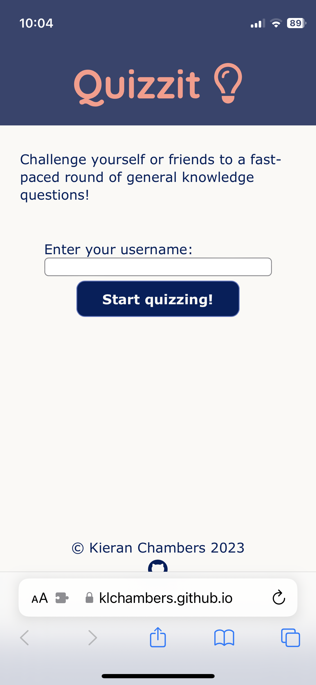
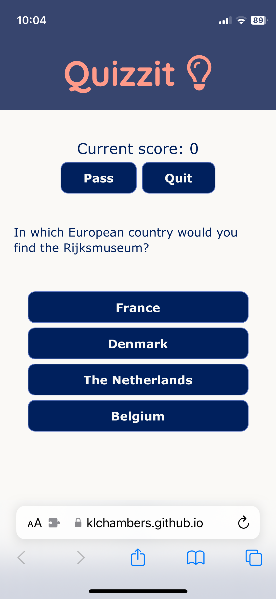
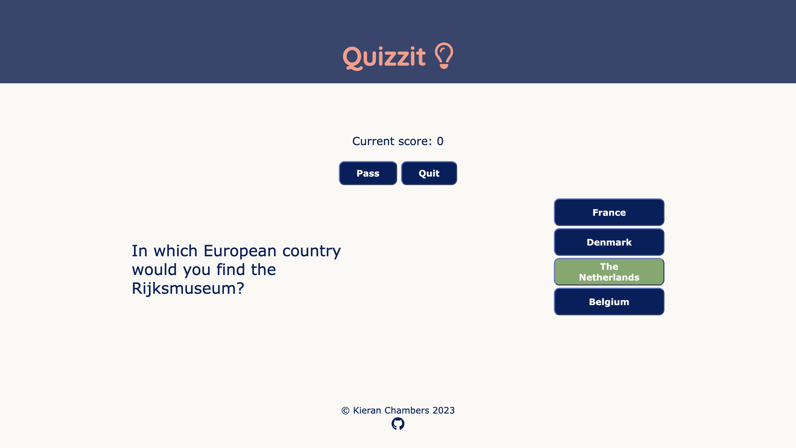
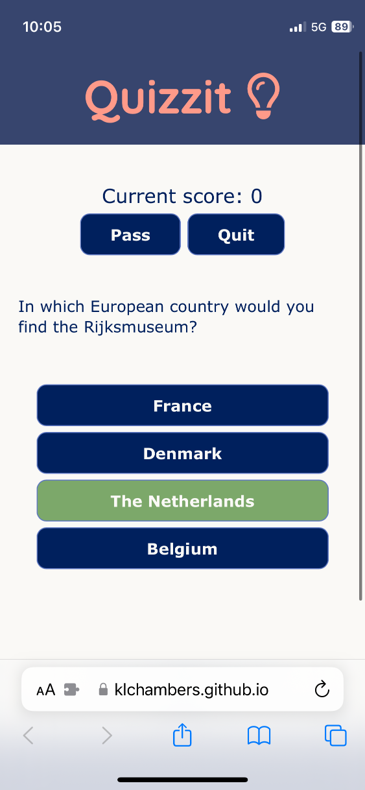
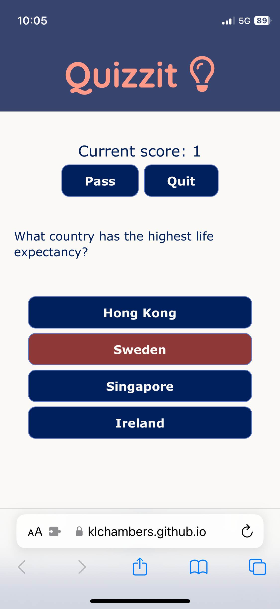
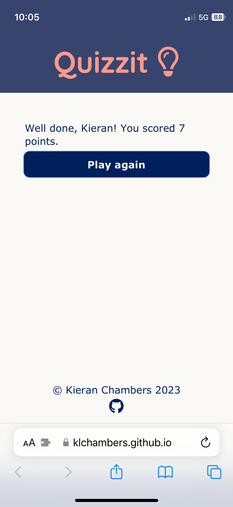
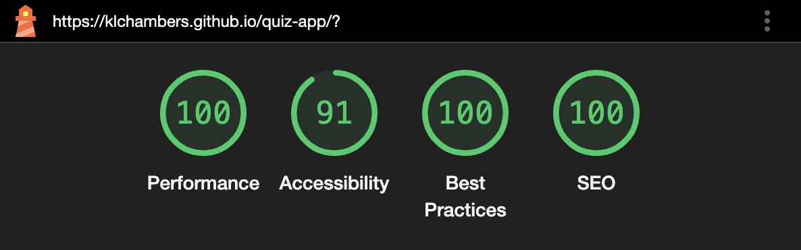

# Quizzit

**Table of contents:**

- [Introduction](#introduction)
- [Deployed Site](#deployed-site)
- [User Experience](#user-experience)
  - [User Goals](#user-goals)
  - [User Stories](#user-stories)
- [Wireframes](#wireframes)
- [Quizzit Features](#Quizzit-features)
  - [Design](#design)
    - [Colour](#colour)
    - [Typography](#typography)
- [Testing and Validation](#testing-and-validation)
  - [Testing Methodology](#testing-methodology)
  - [Testing](#testing)
  - [Jigsaw CSS Validator](#jigsaw-css-validator)
  - [W3C HTML Validator](#w3c-html-validator)
  - [Lighthouse Accessibility & Performance](#lighthouse-accessibility-&-performance)
- [Development and Deployment](#development-and-deployment)
  - [Development](#development)
  - [Contributing to Quizzit](#contributing-to-Quizzit)
  - [Deployment](#deployment)
- [Technologies Used](#technologies-used)
- [Acknowledgements](#acknowledgements)

## Introduction

Quizzit is a responsive front-end web application through which users can test their knowledge with a series of general knowledge/trivia questions. It is designed with a mobile-first approach, and intuitive UX to allow the user to have fun using it's simple, clutter-free interface.

## Deployed Site

Quizzit can be accessed [here](https://klchambers.github.io/quiz-app/).

## User Experience

### User Goals

- The site should be simple and intuitive
- The site needs to be engaging and responsive when I interact with it
- The quiz content should be interesting and appeal to a range of audiences

### User Stories

- I would like to see visual feedback as I progress through the quiz. For example, my score should be displayed on screen and answers should turn green or red when I choose a correct or incorrect answer
- I would like the content of the quiz to be engaging, with a varied mix of general knowledge questions
- I would like the site to give me the option to try again when I complete the quiz

## Wireframes

During the inception of this project, Balsamiq Wireframes was used to create mockups of the responsiveness I wanted to create across device types.

#### [Quizzit mobile mockup](assets/documentation/wireframes/mobile-wireframe.pdf)

#### [Quizzit browser mockup](assets/documentation/wireframes/desktopbrowser-wireframe.pdf)

## Quizzit Features

Quizzit consists of a single HTML document, with content displayed or hidden depending on the stage of the quiz that the user has reached.

Upon loading the site, the user is shown an introduction section, where they are asked to input their username and select the 'Start quizzing' button. 

JavaScript is used to ensure that the user has input text into the username field. If this field is left blank, they will be unable to start the game, and so will be prompted to enter a username.

Once this has been completed, the introduction section is hidden, using JavaScript, and the main quiz section is displayed. Here, the user is shown their current score, a question, four possible answers, and the options to 'quit' the game or 'pass' the current question. The latter two options are set apart from the answer choices at the top of the screen in order to prevent the user from accidentally quitting the game or skipping a question.

Quitting the game will take the user straight to the results section, with their score up to that point displayed. Choosing 'pass' will skip to the next question without adding a point to their score

Media queries are used in the CSS to create responsiveness in the display of the site depending on the device used by the user to load it.

When the user selects an answer, their choice is displayed in green, if their answer is correct, or red if it is incorrect. When the correct answer is chosen, the user score (displayed at the top of the screen) is incremented by one.

Questions are stored in script.js as objects in an array. They are displayed by altering the page's HTML using JavaScript template literals. This method was employed in order to keep the structure of Quizzit simple and maintainable.

After the 10 questions are completed, the user is shown the 'results section'. Here, their final score is shown, and they are given the choice to play again.

### Design

#### Colour

The user interface of Quizzit is designed to be visually appealing to the user, while remaining simplistic to avoid distracting the user away from the web app itself. The background of the page is a shade of off-white `#faf9f6`  with text in the shade of `#00205d`  to provide contrast and maintain legibility.

Headers and buttons use `#00205d`, and buttons change color to `#5e77c2` on hover to indicate to the user which button/answer they are about to select.

The page's logo uses a light orange(`#ff9a89`) evoke feelings of playfulness and fun to the user, while maintaining a contrast with the page's headers.

#### Typography

[Google Fonts](https://fonts.google.com/) was used to import custom fonts into the CSS.

For the logo in the header, [Quicksand](https://fonts.google.com/specimen/Quicksand/) by Andrew Paglinawan was used, and [Roboto](https://fonts.google.com/specimen/Roboto) by Christian Robertson was selected as the main typeface for all other text in the quiz. These typefaces were chosen for their simplicity and legibility across all device types and screen sizes.

## Testing and Validation

### Testing Methodology

### Testing

### Jigsaw CSS Validator

Quizzit was passed through the W3C Jigsaw CSS Validator and returned no errors or warnings. The results can be viewed [here](https://jigsaw.w3.org/css-validator/validator?uri=https%3A%2F%2Fklchambers.github.io%2Fquiz-app%2F&profile=css3svg&usermedium=all&warning=1&vextwarning=&lang=en).

### W3C HTML Validator

Quizzit was passed through the W3C HTML Validator and returned no errors or warnings. The results can be viewed [here](https://validator.w3.org/nu/?doc=https%3A%2F%2Fklchambers.github.io%2Fquiz-app%2F).

### Lighthouse Accessibility & Performance

Quizzit performed well overall in the Lighthouse performance test. The site passed all audits with the exception of one in the head of the HTML document:

"[user-scalable="no"] is used in the <meta name="viewport"> element or the [maximum-scale] attribute is less than 5."

`<meta name="viewport" content="width=device-width, initial-scale=1.0, maximum-scale=1">`

`maximum-scale=1` was set in order to prevent the screen from zooming in on the username input field when clicked on mobile devices thus hindering the user experience. The page is still zoomable for users who require page magnification and so this audit is acceptable to maintain improved user experience.

The Lighthouse report summary PDF can be accessed [here](assets/documentation/pdf/quizzit-lighthouse-report.pdf).

## Development and Deployment

### Development

Development was started by cloning Code Institute's project template (available [here](https://github.com/Code-Institute-Org/ci-full-template)), and HTML, CSS and JavaScript were written in VSCode with changes pushed to GitHub.

### Contributing to Quizzit

To contribute, make a pull request from the [project repository](https://github.com/klchambers/quiz-app). When merged, any changes will automatically be reflected in the live deployment on Github Pages.

### Deployment

Quizzit has been deployed to GitHub Pages, a cloud-based hosting platform.

In order to deploy a cloned copy or fork of the project to GitHub Pages, follow the steps below:

1. From the GitHub repository, select '**Settings**'
2. In the left-hand menu, under the 'Code and automation' section, select '**Pages**'
3. Ensure _Sources_ is set to '**Deploy from a branch**', and that _Branch_ is set to '**Main**'
4. Click **Save**, the repository will now be available at https://_yourGitHubusername_.github.io/_yourprojectname_/ (for example: https://klchambers.github.io/quiz-app/)

## Technologies Used

- VSCode: Writing and editing HTML and CSS files
- GitHub: Source control
- GitHub Pages: Live deployment of site
- Balsamiq Wireframes: Creating initial webpage layout mockups during project inception

## Acknowledgements

[Favicon.io](https://favicon.io/) was used to generate the favicon for this project.

Questions and answers were adapted from examples provided in [this](https://www.mentimeter.com/blog/audience-energizers/55-free-trivia-and-fun-quiz-question-templates) article by Emma Cullen on Mentimeter.com.
